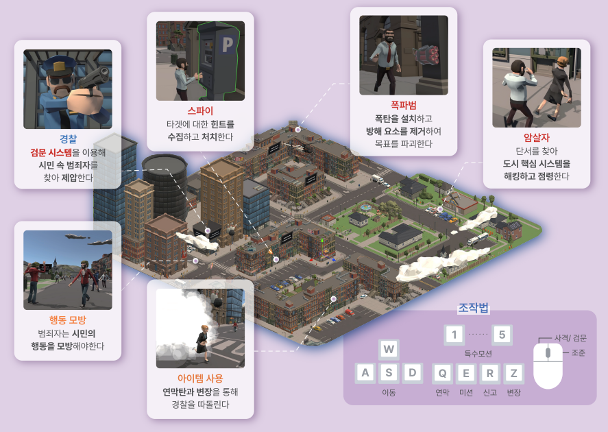

\* 유료 에셋 제거 버전으로 유니티 에디터에서 실행되지 않습니다. itch.io에서 데모버전 플레이 가능합니다*
<h1 align = "center"> ACT LIKE AN NPC!</h1>

   
   
   
   
   

<h2 align = "center"> 실시간 4인 비대칭 서바이벌</h2>

 당신은 도시의 평화를 지키는 경찰이 될 수도, 도시의 평화를 무너뜨릴 흉악한 범죄자가 될 수도 있습니다.

 자신의 역할에 맞는 임무를 수행해 승리하세요! (개인승리) 

 

<h3 align = "center"> 시네마틱 영상 시청 </h3>

 

 

<h3 align = "center"> Live Demo </h3>

 

---

<h2 align = "center"> HOW TO PLAY </h2>

### 역할

| 직업   | 주요목표                                                    |
| ------ | ----------------------------------------------------------- |
| 경찰   | 도시의 안전을 위해 모든 범죄자를 잡으세요.                  |
| 스파이 | 도시의 시스템을 지배하고 목표를 획득하세요.                 |
| 폭파범 | 폭탄을 설치하고 목표를 파괴하세요.                          |
| 암살자 | 미션을 깨 암살 수단을 획득하고 목표를 제거하세요.           |
| NPC    | 맵에서 랜덤하게 움직이는 시민으로, 권장 설정 수는 130~150명 |

 

### 조작키

| Key                             | 주요역할             |
| ------------------------------- | -------------------- |
| WASD                            | 걷기                 |
| Shift + WASD                    | 뛰기                 |
| 마우스 우클릭                   | 조준                 |
| E                               | (범죄자)미션 수행    |
| R                               | (범죄자)신고         |
| Z                               | (범죄자)변장         |
| Q                               | (범죄자)연막탄, 탈출 |
| 1 ~ 5                           | (범죄자)애니메이션   |
| 마우스 우클릭 + 좌클릭          | (경찰)제압           |
| 마우스 우클릭 + 좌클릭 + 좌클릭 | (경찰)사격           |
| F1                              | 직업 및 조작키 설명  |

---

<h3> 1. 경찰 </h3>

- 우클릭하여 제압
- 사격 쿨타임 후 좌클릭하여 사격

 

- 시민 체포 시 / 범죄자 체포 시

<h3> 2. 범죄자 </h3>
 

- 미니맵의 느낌표와 빛기둥을 활용하여 미션 장소를 찾아 E를 눌러 상호작용
- 타이밍을 맞춰 움직이는 빨간 바가 노란 바에 있을 때 E를 누르면 성공 \* 5
- 스크린에 안내되는 시민이벤트를 파악하고 직접 3~5번을 눌러 춤추기
- 검문 당할 시 1~2번을 눌러 시민인 척 하기 / Q로 1회용 연막탄 사용하여 검문 해제 후 도주

 

 

- 스파이 : 3개의 미션을 통해 코드를 받고 최종 미션 후 코드를 조합하여 입력하면 승리

 

- 폭파범 : 폭탄을 설치 후, 3개의 미션을 통해 남은 폭파시간을 단축시켜 폭파시간에 도달하면 승리

 

- 암살자 : 2개의 미션을 통해 암살 타겟의 정보를 얻은 후, 5명의 암살 타겟을 모두 암살하면 승리

---

### 팀 소개

| 이름   | 파트                  | 주요역할                                                         |
| ------ | --------------------- | ---------------------------------------------------------------- |
| 박상민 | 팀장, 메인 클라이언트 | 메인 클라이언트 개발, 이펙트/연출 제작, 영상촬영 및 제작         |
| 이상빈 | 백엔드, 프로젝트 관리 | 프로젝트 리딩, 게임 서버 개발, 인프라 구축(AWS, docker, Jenkins) |
| 김주호 | 기획, 서브 클라이언트 | 전반적인 기획, 모델 제작, 서브 클라이언트 개발                   |

 

### 멘토 소개

| 성함   | 파트          | 소개                              |
| ------ | ------------- | --------------------------------- |
| 신병석 | 지도교수      | 인하대학교 미디어 인공지능 연구실 |
| 박정환 | 프로젝트 멘토 | LG 유플러스 프론트엔드 개발자     |

 

### 사용 기술 및 협업툴

- #### Unity3D URP
- #### 기반 오픈 소스 : <a href="https://github.com/Binary-L0G1C/java-unity-websocket-connector">https://github.com/Binary-L0G1C/java-unity-websocket-connector)</a>
- #### Java 11 / SpringBoot / WebSocket
- #### AWS EC2 / Docker / Jenkins
- #### Git / Git Project / Notion / Figma / JMeter
- #### ClipStudio / Illustrator
 

***

### Demo Video

